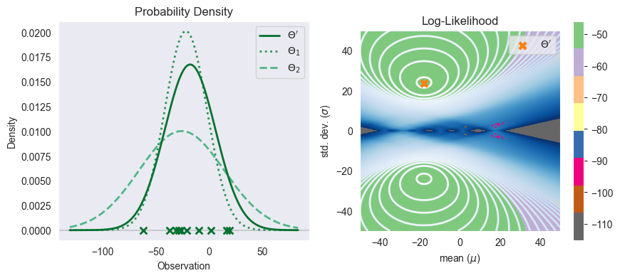

# KT215-BayesianNetworks

## Abstract
If the conditional probability tables (CPTs) are not known beforehand, then given a dataset $\mathbf{\Omega}$ comprising of $n$ samples and $q$ observations, where each observation describes a set of discrete events $\{X_i = j\}$, where $i, j, k \in \mathbf{\Omega} \ | \  i, k \in \mathbb{N}$ , then, by leveraging the relationship between joint probabilities and conditional probabilities, we can express the likelihood of observing a combination of events in terms of smaller components.

## Parameter Estimation
### Joint and Conditional probabilities
For instance, consider the joint probability $P(ABC)$ which can be decomposed into the following product of conditional and marginal probabilities. 
$$P(ABC) = P(A|BC)\times P(B|C) \times P(C)$$
 This decomposition allows us to break down complex chains of observations into manageable conditional probabilities.
### parameterization
The idea is to parameterize these conditional probabilities and further estimate the conditional probabilities that maximize the likelihood of observing our dataset $\mathbf{\Omega}$. We do so by letting 
$$\theta_{ijk} =
P(X_i = j \ | \ pa(X_i) = k)
$$
Meaning $\theta_{ijk}$ is the likelihood of observing a current event $ij$ conditioned on the events $k$.
Where $X_i$ is a random variable in state $j$, and its parents $pa(X_i)$ has the configuration $k$
 Then conceptually, the likelihood of an observation is given by its parameterized product.
$$L(\Theta; ABC) = \theta_{A}\times \theta_{B} \times \theta_{C}$$

### Maximum Likelihood Estimation (MLE)
We've defined our goal as to find a parameter set $\Theta$ which maximizes the likelihood for our data 
$$L(\Theta ; \mathbf{\Omega}) = \prod_{n} P(\mathbf{\Omega}_n \ | \ \Theta)$$